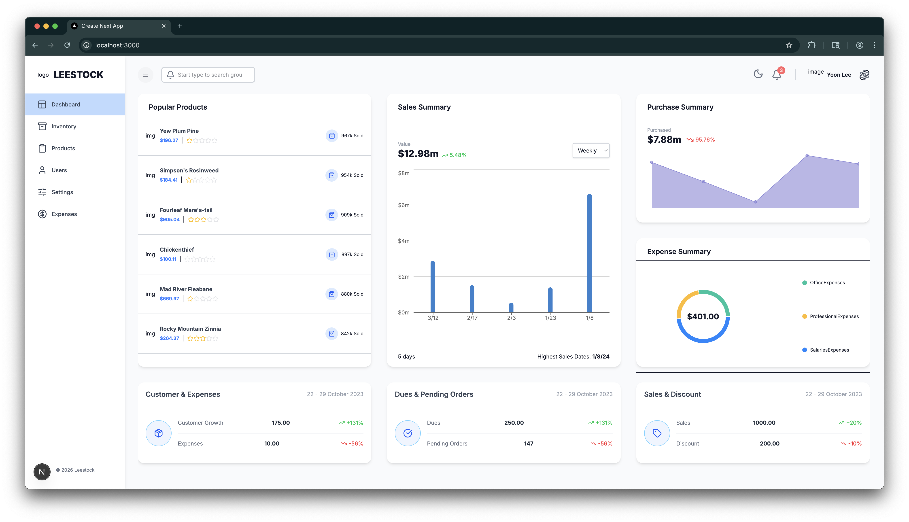
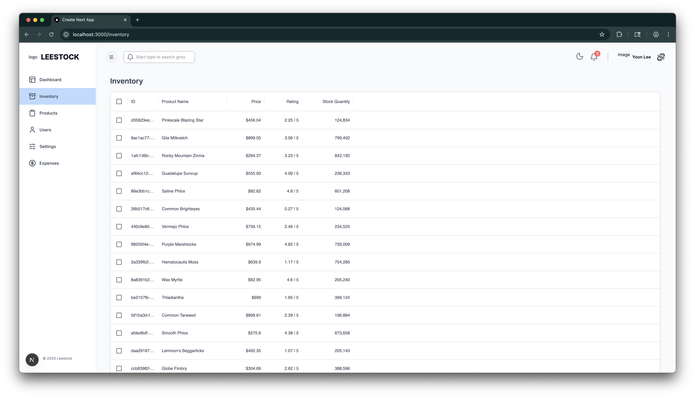

# Inventory Management Dashboard (Full-Stack)

A full-stack inventory management dashboard built with Next.js, Redux Toolkit, Node.js, Prisma, and AWS-focused architecture concepts.

This project demonstrates end-to-end development including frontend UI, backend API design, database modeling, and cloud deployment.

💡 This project is actively being improved, with core features already deployed.

## Live Demo
[View Deployed App](https://main.d3uo79i1ztq862.amplifyapp.com/)

---

## Demo

### Dashboard Overview

| Dashboard | Inventory |
| :---: | :---: |
|  |  |

## 🧭 Overview

The goal of this project is to design and implement a scalable inventory management system featuring:

- Data visualization dashboard
- Product inventory management
- API-driven frontend/backend architecture
- Database schema design using Prisma ORM
- Cloud deployment using AWS infrastructure

---

## 🚀 Current Progress

### ✅ Implemented

- Dashboard visualization
- Inventory page UI
- Frontend (Next.js) and backend/API integration
- Prisma-based database modeling
- Redux Toolkit + RTK Query for state and data fetching
- AWS deployment with live demo

### 🚧 In Progress
- Product creation / update flow improvements
- Error handling and validation
- UI refinements

### 📌 Planned

- Pagination and filtering
- Authentication / role-based access
- Logging and monitoring
- Performance optimization

---

## 🚀 Deployment

### Frontend

- AWS Amplify

### Backend / Database

- Node.js API (AWS)
- Prisma ORM
- AWS RDS

## 🏗 Architecture

### Frontend

- Next.js
- Tailwind CSS
- Material UI Data Grid
- Redux Toolkit
- RTK Query

### Backend

- Node.js
- Express-style API architecture
- Prisma ORM

### Database

- Relational schema designed using Prisma models

### Cloud

- AWS EC2 (Backend hosting)
- AWS RDS (Database)
- AWS S3 (Storage)
- AWS Amplify (Frontend hosting)
- API Gateway

---

## 📂 Project Structure

``` markdown
root/
├── client/ # Next.js frontend
└── server/ # Node.js backend + Prisma
```

---

## ⚙️ Local Setup

### 1️⃣ Clone repository

``` linux
git clone <repo-url>
```

### 2️⃣ Setup Frontend

``` linux
cd client
npm install
npm run dev
```

### 3️⃣ Setup Backend

```linux
cd server
npm install
npx prisma migrate dev
npm run dev
```

### Environment Variables

Create `.env` files based on: `.env.example`

---

## 💡 Learning Goals

This project focuses on:

- Full-stack architecture understanding
- API-driven frontend development
- Database modeling best practices
- Production-oriented project structure
- Cloud-ready system design

---

## 📈 Roadmap

- [x] Fix product creation bug
- [ ] Complete inventory management page
- [ ] Improve API validation
- [ ] Add pagination/filtering
- [x] Deploy to AWS
